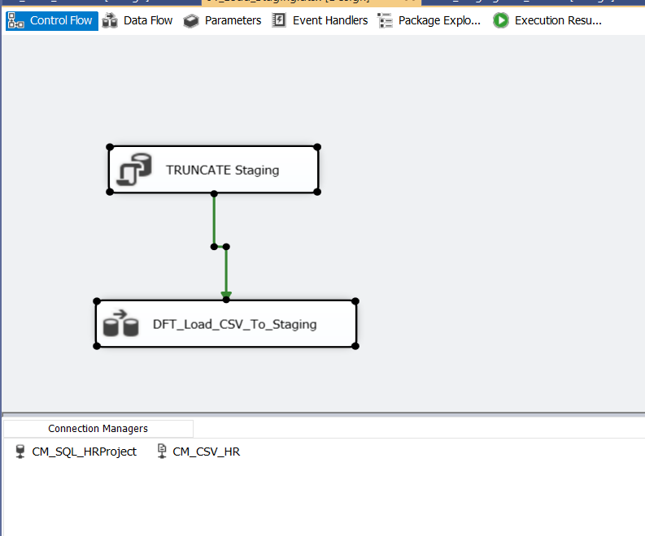
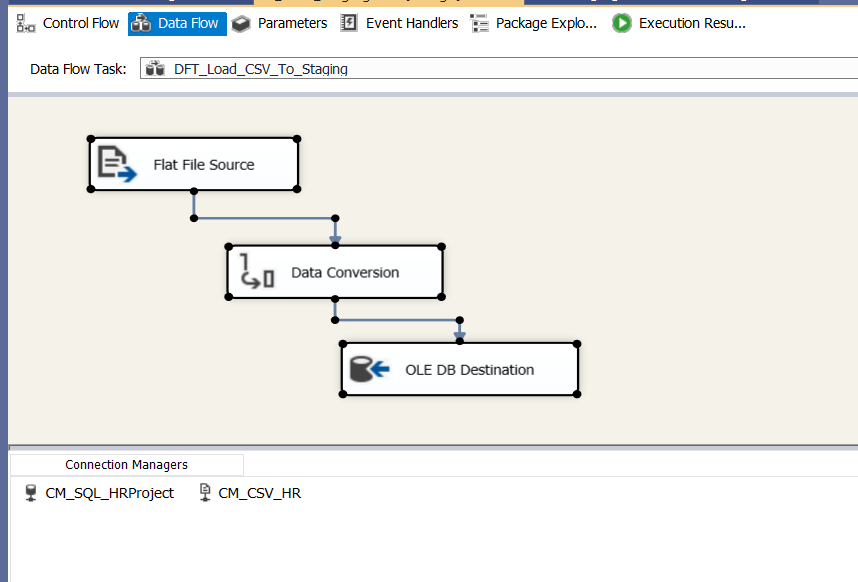
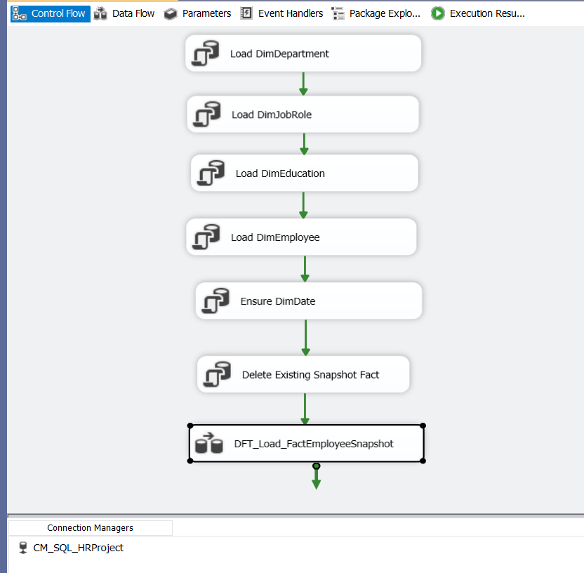
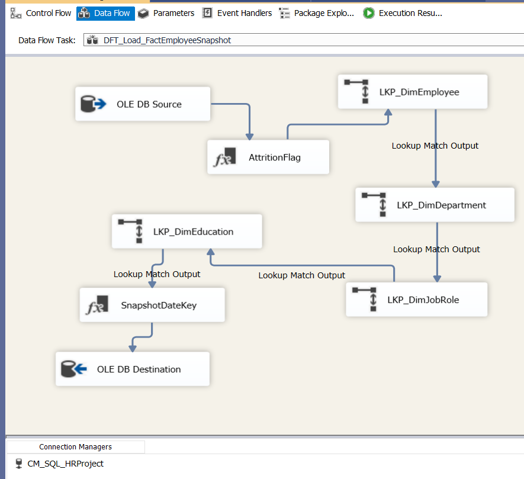
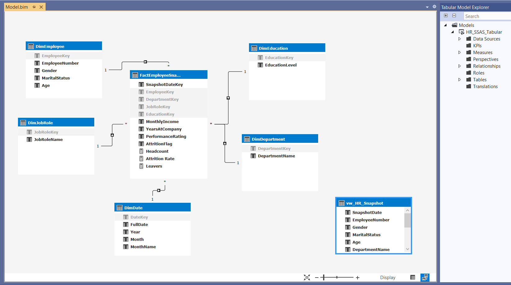
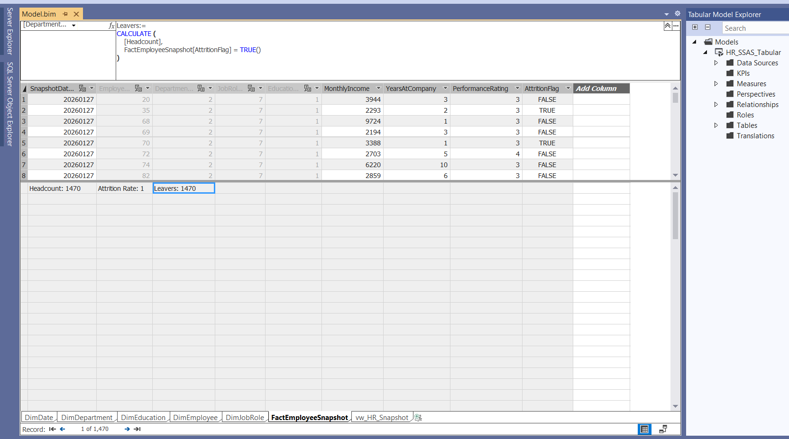
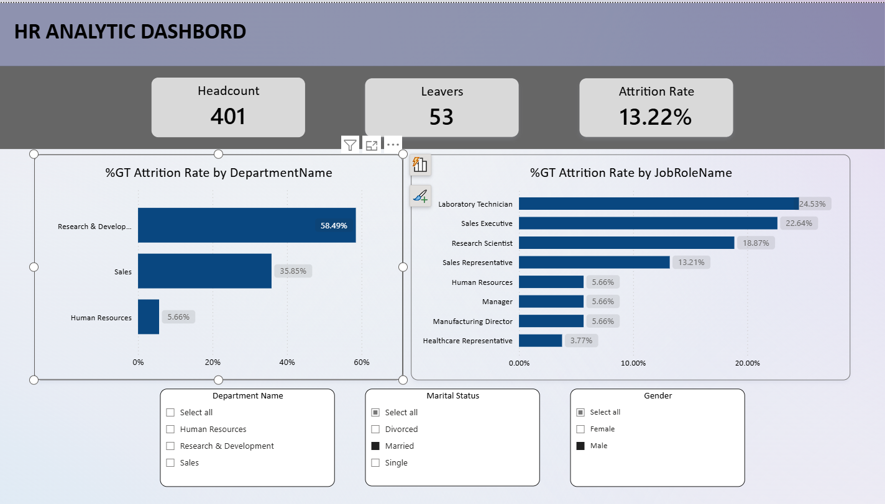

# HR Data Warehouse ETL  
(SQL Server + SSIS + SSAS Tabular + Power BI)

## Overview
End-to-end HR data engineering and BI project demonstrating a layered enterprise-style architecture:

**CSV source → SQL Server Staging → Data Warehouse (Star Schema) → SSAS Tabular → Power BI**

The project focuses on building a reliable ETL pipeline, a dimensional data warehouse, a semantic layer, and business-ready analytics.

---

## Dataset
IBM HR Analytics Employee Attrition dataset (CSV).

---

## Tech Stack
- SQL Server (SSMS)
- SSIS (Visual Studio)
- SSAS Tabular
- Power BI
- GitHub

---

## Architecture
- **Staging:**  
  `dbo.stg_hr_employee_raw` – raw CSV ingestion layer

- **Data Warehouse (`dw` schema):**
  - Dimensions:
    - `dw.DimEmployee`
    - `dw.DimDepartment`
    - `dw.DimJobRole`
    - `dw.DimEducation`
    - `dw.DimDate`
  - Fact:
    - `dw.FactEmployeeSnapshot`  
      *(Primary Key: SnapshotDateKey + EmployeeKey)*

- **Semantic Layer:**  
  SSAS Tabular model built on top of the data warehouse

---

## ETL (SSIS)

### Package 01: `01_Load_Staging.dtsx`
- Loads the raw HR CSV file into SQL Server staging
- Handles data type conversions and data consistency
- Prepares data for downstream warehouse processing

### Package 02: `02_Load_DW.dtsx`
- Loads dimension tables from the staging layer
- Ensures the daily snapshot date exists in `dw.DimDate`
- Deletes existing snapshot records for the load date
- Loads `dw.FactEmployeeSnapshot` using Lookup transforms to generate surrogate keys

---

## Data Quality & Validation
- Record counts validated between staging and fact tables (1470 rows)
- Basic checks for nulls and duplicates in key columns
- Snapshot-based loading ensures idempotent daily fact loads

---

## Semantic Layer (SSAS Tabular)

An SSAS Tabular model is implemented on top of the SQL Server data warehouse to provide
a centralized semantic layer for analytics and reporting.

### Model Details
- Model type: SSAS Tabular
- Source: SQL Server Data Warehouse (`dw` schema)
- Fact table: `dw.FactEmployeeSnapshot`
- Dimension tables:
  - `dw.DimEmployee`
  - `dw.DimDepartment`
  - `dw.DimJobRole`
  - `dw.DimEducation`
  - `dw.DimDate`

### Relationships
A star schema is implemented with one-to-many relationships from dimensions to the fact table,
using single-direction cross filtering.

### Core Measures (DAX)
- **Headcount** – distinct count of employees
- **Leavers** – employees flagged as attrition
- **Attrition Rate** – ratio of leavers to total headcount

### Deployment
The SSAS Tabular model is deployed to a local Analysis Services instance and validated using
live connections from Power BI.

---

## Power BI
Power BI connects to the SSAS Tabular model via live connection to ensure centralized business logic.
Dashboards include:
- Headcount
- Attrition rate
- Attrition by department and job role
- Income and tenure analysis

---

## How to Run the Project Locally

### Prerequisites
- SQL Server (LocalDB or full instance)
- SQL Server Management Studio (SSMS)
- Visual Studio with SQL Server Integration Services (SSIS)
- SQL Server Analysis Services (Tabular)
- Power BI Desktop

### Step 1: Database and Schema Setup
Run the following script in SSMS:
- `SQL/00_setup.sql`

### Step 2: Create Staging Table
Create the staging table structure:
- `SQL/01_staging_table.sql`

### Step 3: Create Data Warehouse Tables
Create all dimension and fact tables:
- `SQL/02_dw_tables.sql`

### Step 4: Load Staging Data (SSIS)
Open the SSIS solution in Visual Studio and run:
- `01_Load_Staging.dtsx`

This package loads the raw HR CSV file into:
`dbo.stg_hr_employee_raw`.

### Step 5: Load Dimensions and Fact (SSIS)
Run:
- `02_Load_DW.dtsx`

This package:
- Loads dimension tables
- Ensures the snapshot date exists
- Replaces existing snapshot fact data
- Loads the fact table using Lookup transforms

### Step 6: Create Reporting View
Create the BI-friendly SQL view:
- `SQL/06_view_vw_hr_snapshot.sql`

### Step 7: Validate the Load
Run validation queries:
- `SQL/07_validation_checks.sql`

---

## Screenshots

### SSIS – Load Staging
  

### SSIS – Load Data Warehouse
  

### SSAS Tabular Model

### SSAS Measures

### Power BI Dashboard

